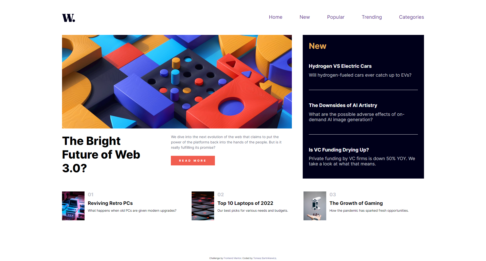

# Frontend Mentor - News homepage solution

This is a solution to the [News homepage challenge on Frontend Mentor](https://www.frontendmentor.io/challenges/news-homepage-H6SWTa1MFl). Frontend Mentor challenges help you improve your coding skills by building realistic projects. 

### The challenge

Users should be able to:

- View the optimal layout for the interface depending on their device's screen size
- See hover and focus states for all interactive elements on the page
- **Bonus**: Toggle the mobile menu (requires some JavaScript)

### Screenshot

### Links

- Solution URL: https://github.com/tomaszbar4/New-Homepage
- Live Site URL: [Add live site URL here](https://your-live-site-url.com)

### Built with

- Semantic HTML5 markup
- CSS custom properties
- Flexbox
- Media queries

**Note: These are just examples. Delete this note and replace the list above with your own choices**

### Continued development

I definitely need to practice CSS a little bit more, because sometimes it takes a lot of time for me to adjust position of some specific elements

## Author
- Frontend Mentor - [@yourusername](https://www.frontendmentor.io/profile/tomaszbar4)

